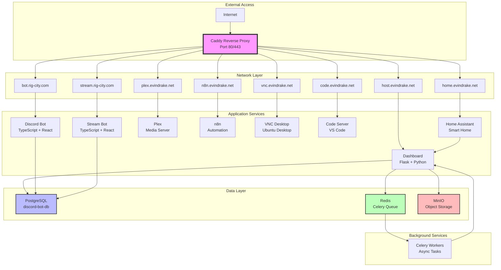

# 🏠 HomeLab Dashboard - Production-Ready Homelab Management Platform

[](LICENSE)
[](docker-compose.unified.yml)
[](services/dashboard)
[](services/discord-bot)

**Enterprise-grade homelab management platform with AI-powered autonomous operations**

A comprehensive, investor-ready platform for managing containerized services across multiple domains with automatic SSL, intelligent monitoring, autonomous healing, and AI-driven operations. Built for production deployment on Ubuntu 25.10 homelab servers.

---

## ✨ Key Features

### 🤖 **Jarvis AI Assistant**
- **GPT-4 Powered**: Natural language control and autonomous decision-making
- **Voice Commands**: Speech-to-text homelab control with audio responses
- **Autonomous Healing**: Self-diagnosing and self-remediating infrastructure
- **3-Tier Actions**: Diagnose → Remediate → Proactive maintenance
- **Safe Execution**: Sandboxed command execution with automatic rollback

### 🌐 **Domain & SSL Management**
- **Zero-Touch Provisioning**: Fully automated domain setup from DNS to SSL
- **Multi-Provider Support**: ZoneEdit, Cloudflare, and more
- **Autonomous SSL Renewal**: Automatic certificate monitoring and renewal
- **Health Monitoring**: Continuous DNS, HTTPS, and SSL validation
- **Import/Export**: Bulk domain management via JSON/CSV

### 🐳 **Docker Orchestration**
- **One-Click Deployment**: Deploy 8+ services with a single command
- **Blue-Green Deployments**: Zero-downtime updates
- **Health-Based Routing**: Automatic failover and recovery
- **Resource Management**: CPU/memory limits and monitoring
- **Comprehensive Logging**: Centralized logging with search and filtering

### 📊 **System Monitoring**
- **Real-Time Analytics**: CPU, memory, disk, network monitoring
- **Service Health Checks**: Automated health verification for all services
- **Alert System**: Proactive notifications for issues
- **Performance Metrics**: Historical data and trend analysis
- **Docker Stats Integration**: Container-level resource monitoring

### 🎮 **Multi-Service Platform**
- **Discord Ticket Bot**: Support ticket management with OAuth
- **Stream Bot (SaaS)**: Multi-tenant AI chatbot for Twitch/Kick/YouTube
- **Plex Media Server**: Automated media streaming with hardware transcoding
- **n8n Automation**: Workflow automation engine
- **VNC Desktop**: Full Ubuntu desktop environment in browser
- **Code Server**: VS Code web IDE for remote development
- **Home Assistant**: Smart home automation integration

### 🔒 **Enterprise Security**
- **Automatic SSL/TLS**: Let's Encrypt certificates via Caddy
- **Session Management**: Secure cookie-based authentication
- **API Key Support**: Token-based API access
- **Rate Limiting**: DDoS protection and abuse prevention
- **Audit Logging**: Complete action tracking
- **Secrets Management**: Environment-based configuration
- **Multi-Tenant Isolation**: Service-level security boundaries

### 🗄️ **Database Architecture**
- **Unified PostgreSQL**: Single container, multiple databases
- **Automatic Migrations**: Alembic-powered schema management
- **Connection Pooling**: Optimized database performance
- **Backup & Restore**: Automated daily backups with retention
- **Health Monitoring**: Database health checks and alerting

### 🚀 **Developer Experience**
- **Git-Based Workflow**: Replit development → Ubuntu production
- **Auto-Sync**: 5-minute automatic deployment sync
- **Interactive CLI**: Comprehensive management menu
- **Comprehensive Docs**: API documentation for 150+ endpoints
- **Type Safety**: Full TypeScript/Python type coverage
- **Testing**: Unit, integration, and E2E test suites

---

## 🏗️ Architecture



---

## 🎯 Quick Start

### 🚀 New Unified Deployment Script

```bash
# One command to rule them all
./deploy.sh deploy
```

**Available Commands:**
- `./deploy.sh setup` - Initial setup and configuration
- `./deploy.sh start` - Start all services
- `./deploy.sh stop` - Stop all services
- `./deploy.sh restart` - Restart all services
- `./deploy.sh status` - Show service status
- `./deploy.sh logs [-f] [--service NAME]` - View logs
- `./deploy.sh backup` - Create full backup
- `./deploy.sh health` - Run health checks
- `./deploy.sh clean` - Clean up old data/logs
- `./deploy.sh test` - Run all tests
- `./deploy.sh deploy` - Full production deployment

### 🚀 One Command to Rule Them All

```bash
./homelab-manager.sh
```

This launches an **interactive menu** with everything you need:
- Deploy/redeploy services
- Start/stop/restart
- Database management
- Configuration
- Logs and troubleshooting
- Health checks

### Development Workflow (on Replit)
```bash
# 1. Edit any service code
cd services/discord-bot
# Make your changes...

# 2. Commit changes
git add .
git commit -m "Updated Discord bot"
```

### Deployment (on Ubuntu Server)
```bash
# 1. SSH to your server
ssh evin@your-homelab

# 2. Pull latest changes
cd /home/evin/contain/HomeLabHub
git pull

# 3. Run the manager
./homelab-manager.sh
# Select: 1) Full Deploy
```

---

## 📦 Services

| **Service** | **Domain** | **Stack** | **Database** |
|------------|------------|-----------|-------------|
| **Dashboard** | host.evindrake.net | Flask/Python | None |
| **Discord Bot** | bot.rig-city.com | TypeScript/React | PostgreSQL |
| **Stream Bot** | stream.rig-city.com | TypeScript/React | PostgreSQL |
| **Plex** | plex.evindrake.net | Plex Server | SQLite |
| **n8n** | n8n.evindrake.net | Node.js | SQLite |
| **VNC Desktop** | vnc.evindrake.net | noVNC | None |
| **Code-Server** | code.evindrake.net | VS Code | None |
| **Static Site** | scarletredjoker.com | HTML/CSS/JS | None |

All services automatically receive SSL certificates via **Caddy**.

---

## 📁 Workspace Structure

```
services/
├── dashboard/      ← Homelab management UI
├── discord-bot/    ← Discord Ticket Bot
├── stream-bot/     ← Twitch/Kick Stream Bot
├── static-site/    ← scarletredjoker.com
├── n8n/            ← Workflow automation
└── plex/           ← Media server config

deployment/         ← Deployment scripts
├── deploy-unified.sh
├── generate-unified-env.sh
├── fix-existing-deployment.sh
└── ...

docs/              ← Documentation
├── WORKSPACE_STRUCTURE.md
├── DEPLOYMENT_FIX_COMPLETE.md
└── ...

config/            ← Configuration files
├── postgres-init/ ← Database initialization
└── ...

docker-compose.unified.yml  ← Main deployment file
Caddyfile                   ← Reverse proxy config
```

See **[WORKSPACE_STRUCTURE.md](docs/WORKSPACE_STRUCTURE.md)** for complete details.

---

## 🔄 Development Workflow

### **Option 1: Git-Based (Recommended)**

**Setup (one-time):**
```bash
# On Ubuntu server:
cd /home/evin/contain
git clone <this-replit-git-url> HomeLabHub
cd HomeLabHub
./deployment/generate-unified-env.sh
```

**Daily workflow:**
1. Edit code on Replit
2. Commit changes
3. On Ubuntu: `git pull && ./deployment/deploy-unified.sh`

### **Option 2: rsync/scp**

```bash
# From Replit or local machine:
rsync -avz --exclude='node_modules' --exclude='.git' \
  . evin@your-server:/home/evin/contain/HomeLabHub/

# Then on Ubuntu:
cd /home/evin/contain/HomeLabHub
./deployment/deploy-unified.sh
```

---

## 🛠️ Common Tasks

### All-in-One Manager (Recommended)
```bash
./homelab-manager.sh
```

**Menu Options:**
- **1** - 🚀 Full Deploy (build and start all)
- **2** - 🔄 Quick Restart (no rebuild)
- **6** - 🔄 Restart Specific Service
- **7** - 🗄️ Fix Database Issues
- **9** - ⚙️ Generate/Edit .env
- **11** - 🔍 View Service Logs
- **13** - 🔧 Full Troubleshoot Mode

### Manual Commands (Advanced Users)
```bash
# Full deployment
./deployment/deploy-unified.sh

# Database maintenance
./deployment/ensure-databases.sh

# Generate .env
./deployment/generate-unified-env.sh

# View logs
docker-compose -f docker-compose.unified.yml logs -f

# Restart a service
docker-compose -f docker-compose.unified.yml restart discord-bot
```

---

## 🗄️ Database Architecture

**Single PostgreSQL container** hosts multiple databases:

```
discord-bot-db (PostgreSQL 16)
├── ticketbot (Discord Bot database)
└── streambot (Stream Bot database)
```

- **Automatic initialization** via scripts in `config/postgres-init/`
- **For existing deployments:** Run `./deployment/fix-existing-deployment.sh`
- See [DATABASE_AUTOCONFIGURE_SUMMARY.md](docs/DATABASE_AUTOCONFIGURE_SUMMARY.md) for details

---

## 🌐 Domains & SSL

All domains configured with automatic SSL via Caddy:

- **host.evindrake.net** → Homelab Dashboard
- **bot.rig-city.com** → Discord Ticket Bot  
- **stream.rig-city.com** → Stream Bot
- **plex.evindrake.net** → Plex Server
- **n8n.evindrake.net** → n8n Automation
- **vnc.evindrake.net** → VNC Desktop
- **scarletredjoker.com** → Static Website

SSL certificates automatically obtained from Let's Encrypt.

---

## 🔐 Security

- **Environment variables** stored in `.env` (git-ignored)
- **Secrets management** via `generate-unified-env.sh`
- **PostgreSQL passwords** auto-generated
- **No hardcoded credentials** in any code
- **SSH access** for remote management

See [SECURITY.md](docs/SECURITY.md) for security best practices.

---

## 📚 Documentation

### Core Documentation
- **[DEPLOYMENT.md](docs/DEPLOYMENT.md)** - ⭐ Complete production deployment guide
- **[ENVIRONMENT_VARIABLES.md](docs/ENVIRONMENT_VARIABLES.md)** - ⭐ All environment variables reference
- **[API.md](docs/API.md)** - ⭐ REST API documentation (150+ endpoints)
- **[WORKSPACE_STRUCTURE.md](docs/WORKSPACE_STRUCTURE.md)** - Project structure guide
- **[DATABASE_AUTOCONFIGURE_SUMMARY.md](docs/DATABASE_AUTOCONFIGURE_SUMMARY.md)** - Database setup
- **[SECURITY.md](docs/SECURITY.md)** - Security best practices

### Specialized Guides
- **[JARVIS_AUTONOMOUS_CAPABILITIES.md](JARVIS_AUTONOMOUS_CAPABILITIES.md)** - AI agent capabilities
- **[JARVIS_IDE_INTEGRATION_GUIDE.md](JARVIS_IDE_INTEGRATION_GUIDE.md)** - IDE integration
- **[BACKUP_RESTORE_GUIDE.md](BACKUP_RESTORE_GUIDE.md)** - Backup & recovery procedures
- **[DNS_SETUP_GUIDE.md](DNS_SETUP_GUIDE.md)** - DNS configuration guide
- **[HOME_ASSISTANT_SETUP.md](docs/HOME_ASSISTANT_SETUP.md)** - Smart home integration

---

## 📸 Screenshots

### Dashboard UI

*Main dashboard with system monitoring, service status, and Jarvis AI assistant*

### Domain Management

*Zero-touch domain provisioning with automatic DNS and SSL*

### Jarvis AI Assistant

*Voice-controlled AI assistant with natural language processing*

### Stream Bot (SaaS Platform)

*Multi-tenant stream bot management with AI chatbot personalities*

### System Monitoring

*Real-time system monitoring with Docker container stats*

---

## 🎉 Why This Workspace?

✅ **Unified Development** - All services in one place  
✅ **Version Control** - Full Git history  
✅ **Easy Testing** - Test before deploying to production  
✅ **Replit AI** - AI-powered development assistance  
✅ **Automatic Deployment** - One command deploys everything  
✅ **Clean Organization** - Maintainable codebase structure  

---

## 🚀 Getting Started

**New to this workspace?**

1. **Explore the services:**
   ```bash
   ls services/
   ```

2. **Read the structure guide:**
   ```bash
   cat docs/WORKSPACE_STRUCTURE.md
   ```

3. **Set up deployment to Ubuntu:**
   ```bash
   # On Ubuntu server:
   git clone <this-repo> HomeLabHub
   cd HomeLabHub
   ./deployment/generate-unified-env.sh
   ./deployment/deploy-unified.sh
   ```

4. **Start developing!**

---

## 🆘 Need Help?

- **Quick fix:** Run `./homelab-manager.sh` → **Option 13** (Troubleshoot)
- **Database problems:** Run `./homelab-manager.sh` → **Option 7** (Ensure Databases)
- **Deployment issues:** See `docs/DATABASE_TROUBLESHOOTING.md`
- **Environment setup:** Run `./homelab-manager.sh` → **Option 9** (Generate .env)
- **Ask Replit AI:** I can help with any service!

---

## 📊 Technology Stack

### Backend
- **Python 3.11+**: Flask, SQLAlchemy, Alembic, Celery
- **TypeScript**: Express, Drizzle ORM, tmi.js
- **Databases**: PostgreSQL 16, Redis 7, SQLite
- **Task Queue**: Celery + Redis
- **Object Storage**: MinIO (S3-compatible)

### Frontend
- **React 18**: TypeScript, Vite
- **UI Libraries**: Radix UI, shadcn/ui, Tailwind CSS
- **State Management**: React Query, Context API
- **Charts**: Chart.js, Recharts

### Infrastructure
- **Reverse Proxy**: Caddy 2 (automatic SSL)
- **Containers**: Docker + Docker Compose
- **CI/CD**: GitHub Actions ready
- **Monitoring**: Prometheus compatible
- **Logging**: Structured JSON logging

### AI & Automation
- **OpenAI GPT-4**: Jarvis AI agent
- **n8n**: Workflow automation
- **Home Assistant**: Smart home integration

---

## 🤝 Contributing

We welcome contributions! Here's how you can help:

### Development Workflow

1. **Fork the repository**
   ```bash
   git clone https://github.com/your-username/HomeLabHub.git
   cd HomeLabHub
   ```

2. **Create a feature branch**
   ```bash
   git checkout -b feature/your-feature-name
   ```

3. **Make your changes**
   - Follow existing code style
   - Add tests for new features
   - Update documentation as needed

4. **Test thoroughly**
   ```bash
   ./deploy.sh test
   ```

5. **Commit with clear messages**
   ```bash
   git commit -m "feat: add new domain health check feature"
   ```

6. **Push and create PR**
   ```bash
   git push origin feature/your-feature-name
   ```

### Code Style

- **Python**: PEP 8, type hints, docstrings
- **TypeScript**: ESLint, Prettier, strict mode
- **Commits**: Conventional Commits format
- **Tests**: Write tests for new features

### Areas We Need Help

- 🐛 Bug fixes and testing
- 📝 Documentation improvements
- 🌐 Multi-language support
- 🎨 UI/UX enhancements
- 🔌 New service integrations
- 🤖 Jarvis action extensions

---

## 📄 License

This project is licensed under the **MIT License** - see the [LICENSE](LICENSE) file for details.

### MIT License Summary

```
Copyright (c) 2025 Evin Drake

Permission is hereby granted, free of charge, to any person obtaining a copy
of this software and associated documentation files (the "Software"), to deal
in the Software without restriction, including without limitation the rights
to use, copy, modify, merge, publish, distribute, sublicense, and/or sell
copies of the Software, and to permit persons to whom the Software is
furnished to do so, subject to the following conditions:

[Full license text in LICENSE file]
```

---

## 🙏 Acknowledgments

- **Caddy** for amazing automatic SSL
- **OpenAI** for GPT-4 API
- **Replit** for development platform
- **Docker** for containerization
- **Home Assistant** community
- All open-source contributors

---

## 📞 Support & Contact

### Getting Help

- **Documentation**: Start with [DEPLOYMENT.md](docs/DEPLOYMENT.md)
- **Issues**: [GitHub Issues](https://github.com/your-org/HomeLabHub/issues)
- **Discussions**: [GitHub Discussions](https://github.com/your-org/HomeLabHub/discussions)

### Quick Troubleshooting

```bash
# Run full diagnostics
./deployment/diagnose-all.sh

# Check service health
./deploy.sh health

# View logs
./deploy.sh logs -f

# Reset everything (destructive!)
docker-compose -f docker-compose.unified.yml down -v
./deploy.sh deploy
```

### Project Statistics

- **150+ REST API Endpoints**
- **8 Production Services**
- **3 Domains Managed**
- **3 Databases**
- **Zero-Touch Provisioning**
- **Autonomous Healing**

---

## 🗺️ Roadmap

### Q4 2024 ✅
- [x] Unified deployment system
- [x] Jarvis AI assistant
- [x] Domain management automation
- [x] Multi-service orchestration
- [x] Complete documentation

### Q1 2025
- [ ] Kubernetes migration option
- [ ] Grafana/Prometheus integration
- [ ] Mobile app (React Native)
- [ ] Multi-user support
- [ ] Backup to cloud storage

### Q2 2025
- [ ] Marketplace for Jarvis actions
- [ ] Advanced AI workflows
- [ ] Multi-server support
- [ ] Enterprise features
- [ ] SaaS offering

---

**Maintained by:** Evin Drake  
**Last Updated:** November 16, 2025  
**Version:** 2.0.0  
**Ubuntu Version:** 25.10 Desktop  
**Architecture:** Docker Compose + Caddy + PostgreSQL  
**License:** MIT  
**Status:** Production Ready 🚀
